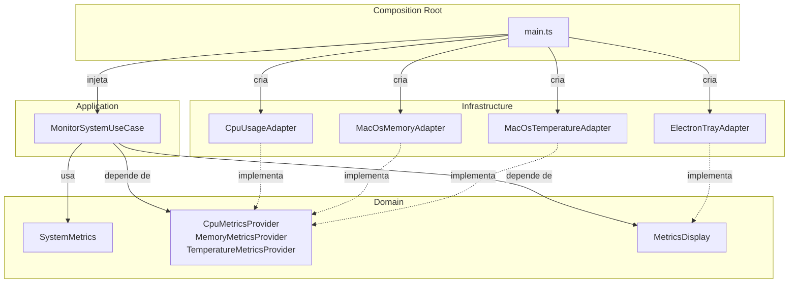

# ⚙️ System Status

Aplicação utilitária para **macOS** que exibe métricas do sistema em tempo real diretamente na **menu bar**, usando Electron.


---

## 📊 Métricas Monitoradas

| Métrica | Fonte | Exibição |
|---|---|---|
| **CPU** | `os-utils` | Menu bar (título do tray) |
| **RAM** | `vm_stat` (fallback: `os` module) | Menu bar (título do tray) |
| **Temperatura da Bateria** | `ioreg` (AppleSmartBattery) | Menu de contexto |

As métricas são atualizadas automaticamente a cada **2 segundos**.

---

## 🚀 Como Usar

### Pré-requisitos

- **Node.js** >= 20
- **npm**

### Instalar dependências

```bash
npm install
```

### Rodar em modo desenvolvimento

```bash
npm start
```

### Gerar build de distribuição (`.dmg`)

```bash
npm run dist
```

O `.dmg` será gerado na pasta `release/`.

---

## 🏗️ Arquitetura

O projeto segue a **Arquitetura Hexagonal (Ports & Adapters)**, onde cada camada tem sua responsabilidade bem definida e as dependências sempre apontam para o centro (domínio).

```
src/
├── domain/                                  🟢 Núcleo — zero dependências externas
│   ├── entities/
│   │   └── system-metrics.ts                Entidade de métricas do sistema
│   └── ports/
│       ├── metrics-provider.port.ts         Ports de entrada (CPU, RAM, Temp)
│       └── metrics-display.port.ts          Port de saída (exibição)
│
├── application/                             🟡 Casos de uso — orquestração
│   └── usecases/
│       └── monitor-system.usecase.ts        Coleta métricas → atualiza display
│
├── infrastructure/                          🔴 Adapters — implementações concretas
│   └── adapters/
│       ├── cpu-usage.adapter.ts             CPU via os-utils
│       ├── macos-memory.adapter.ts          RAM via vm_stat
│       ├── macos-temperature.adapter.ts     Temperatura via ioreg
│       └── electron-tray.adapter.ts         Exibição via Electron Tray
│
└── main.ts                                  🔵 Composition Root
```

### Fluxo de Dependências



### Camadas

#### 🟢 Domain — Núcleo

Contém as **regras de negócio puras** e as **interfaces (ports)** que definem contratos para o mundo externo. Não depende de nenhuma biblioteca, framework ou serviço do sistema operacional.

- **`SystemMetrics`** — Value object que define a estrutura dos dados de métricas (CPU, RAM, temperatura).
- **`CpuMetricsProvider`** / **`MemoryMetricsProvider`** / **`TemperatureMetricsProvider`** — Ports de entrada que definem como as métricas são coletadas, sem saber de onde vêm.
- **`MetricsDisplay`** — Port de saída que define como as métricas são exibidas, sem saber se é um tray, CLI, ou web UI.

#### 🟡 Application — Casos de Uso

Contém a **lógica de orquestração** da aplicação. Depende apenas dos ports do domínio.

- **`MonitorSystemUseCase`** — Responsável por coletar as métricas (via providers), montar o objeto `SystemMetrics`, e enviar para o display. Gerencia o loop de atualização periódica.

#### 🔴 Infrastructure — Adapters

Contém as **implementações concretas** dos ports. É aqui que vivem as dependências externas (Electron, `os-utils`, chamadas de sistema).

| Adapter | Implementa | Tecnologia |
|---|---|---|
| `CpuUsageAdapter` | `CpuMetricsProvider` | Lib `os-utils` |
| `MacOsMemoryAdapter` | `MemoryMetricsProvider` | Comando `vm_stat` / fallback via Node `os` |
| `MacOsTemperatureAdapter` | `TemperatureMetricsProvider` | Comando `ioreg` (AppleSmartBattery) |
| `ElectronTrayAdapter` | `MetricsDisplay` | Electron `Tray` + `Menu` |

#### 🔵 Composition Root (`main.ts`)

Ponto de entrada da aplicação. É o **único lugar** que conhece as implementações concretas. Responsável por:

1. Instanciar os adapters
2. Injetar os adapters no use case
3. Gerenciar o lifecycle do Electron (`app.whenReady`, `will-quit`)

---

## 🔌 Extensibilidade

Graças à arquitetura hexagonal, é fácil estender o projeto:

| O que você quer fazer | Como fazer |
|---|---|
| Adicionar nova métrica (ex: disco) | Crie um novo port em `domain/ports/` e um adapter em `infrastructure/adapters/` |
| Trocar Tray por CLI | Crie um novo adapter que implemente `MetricsDisplay` |
| Testar o use case | Injete mocks dos ports — sem precisar do Electron |
| Suportar Linux | Crie adapters Linux (ex: lendo `/proc/meminfo`) e troque no `main.ts` |

---

## 🛠️ Scripts Disponíveis

| Comando | Descrição |
|---|---|
| `npm start` | Compila TypeScript e inicia o app com Electron |
| `npm run build` | Apenas compila o TypeScript (`tsc`) |
| `npm run dist` | Compila e gera o pacote de distribuição (`.dmg`) |

---

## 📋 Stack

- **Runtime:** [Electron](https://www.electronjs.org/) 41
- **Linguagem:** [TypeScript](https://www.typescriptlang.org/) 5.9
- **CPU Metrics:** [os-utils](https://www.npmjs.com/package/os-utils)
- **Build/Packaging:** [electron-builder](https://www.electron.build/)

---

## 📄 Licença

ISC
